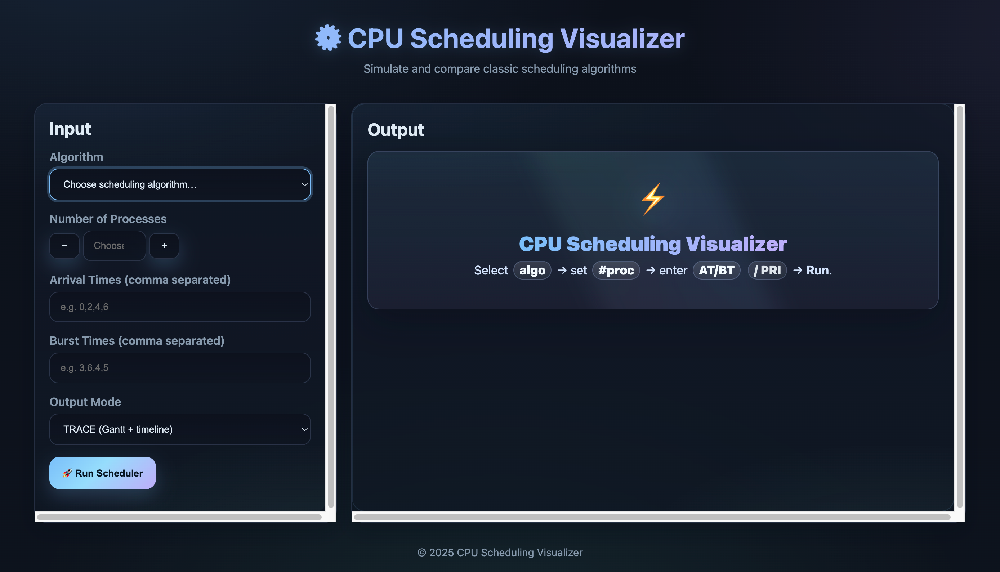
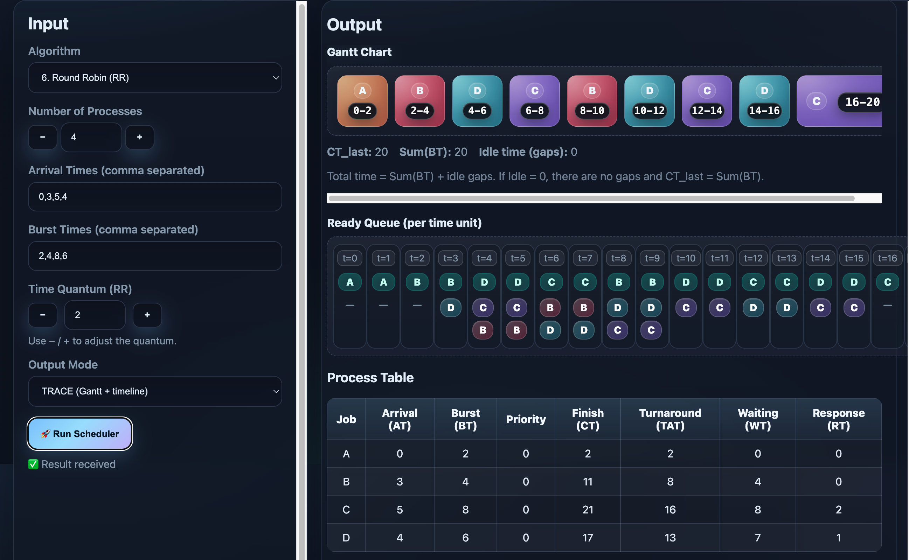
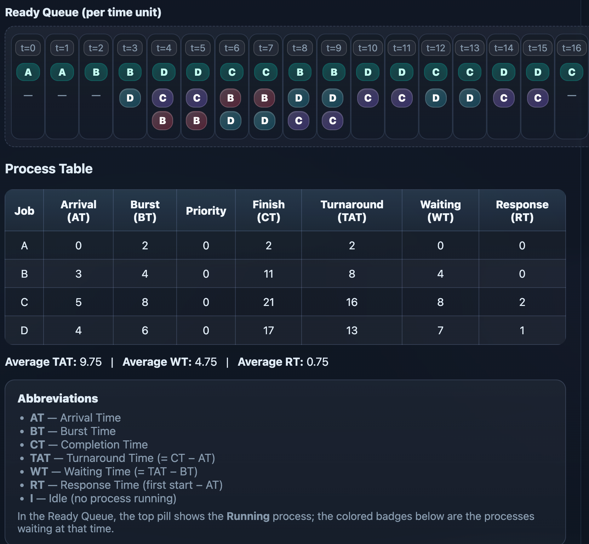

# CPU Scheduler Visualizer

This project is a comprehensive **CPU Scheduling Algorithms Visualizer and Simulator**. It is built to help students and professionals understand how different CPU scheduling algorithms work and how they affect process execution over time.


## 🖥️ What It Does

- Takes user input via a web frontend for process details: Arrival Time, Burst Time, and Priority (optional).
- Simulates scheduling using various classic algorithms.
- Displays:
  - 🟦 **Gantt Chart**: Shows when each process runs, with distinct colors per process.
  - 🟩 **Ready Queue**: Shows the set of waiting processes at each time unit.
  - 🟨 **Process Table**: Displays Turnaround Time (TAT), Waiting Time (WT), Response Time (RT), and Normalized TAT.

Each process is shown in a different color, making it easier to visualize execution order, idle times, and preemption (if applicable).

## 📌 Supported Algorithms

Below are the 10 CPU scheduling algorithms implemented in this project, along with their behavior and use cases:

---

### 1. First Come First Serve (FCFS)

- **Type:** Non-Preemptive  
- **Working:** Processes are scheduled in the order they arrive.
- **Advantage:** Simple and easy to implement.
- **Disadvantage:** Long jobs can delay shorter ones (convoy effect).
- **Use Case:** Suitable for batch processing systems.

---

### 2. Round Robin (RR)

- **Type:** Preemptive  
- **Working:** Each process gets a fixed time slice (quantum). After using its time, it goes to the back of the ready queue.
- **Advantage:** Fair CPU allocation among all processes.
- **Disadvantage:** Too large a quantum leads to FCFS-like behavior; too small leads to high context switching.
- **Use Case:** Ideal for time-sharing operating systems.

---

### 3. Shortest Process Next (SPN) / Shortest Job First (SJF)

- **Type:** Non-Preemptive  
- **Working:** Runs the process with the shortest burst time among ready processes.
- **Advantage:** Minimizes average waiting time.
- **Disadvantage:** Risk of starvation for longer processes.
- **Use Case:** Systems where burst time is known in advance.

---

### 4. Shortest Remaining Time (SRT)

- **Type:** Preemptive  
- **Working:** Runs the process with the least remaining execution time.
- **Advantage:** Reduces average waiting time compared to SPN.
- **Disadvantage:** Frequent preemptions and possible starvation of long jobs.
- **Use Case:** Real-time or highly responsive systems.

---

### 5. Highest Response Ratio Next (HRRN)

- **Type:** Non-Preemptive  
- **Working:** Selects process with highest response ratio:
  \[
  \text{Response Ratio} = \frac{\text{Waiting Time} + \text{Burst Time}}{\text{Burst Time}}
  \]
- **Advantage:** Balances fairness and efficiency. Prevents starvation.
- **Disadvantage:** Requires calculating response ratio for all ready processes.
- **Use Case:** Balanced scheduling in production or job queues.

---

### 6. Feedback (FB)

- **Type:** Preemptive, Multi-level Queues  
- **Working:** Processes start at high priority. If they don’t finish, they are demoted to lower queues.
- **Advantage:** Dynamic priority adjustment improves responsiveness.
- **Disadvantage:** Longer jobs may be delayed repeatedly.
- **Use Case:** Mixed workloads with both short and long processes.

---

### 7. Feedback with Varying Quantum (FBV)

- **Type:** Preemptive, Multi-level Queues  
- **Working:** Similar to FB but each queue has increasing time quantum (e.g., 1, 2, 4...).
- **Advantage:** Short jobs finish quickly; long jobs gradually get more CPU time.
- **Disadvantage:** May still cause starvation without proper tuning.
- **Use Case:** Interactive systems where adaptive scheduling is critical.

---

### 8. Aging

- **Type:** Priority-based with dynamic updates  
- **Working:** Waiting processes have their priority increased gradually to avoid starvation.
- **Advantage:** Ensures even low-priority jobs eventually get executed.
- **Disadvantage:** Adds overhead of managing dynamic priorities.
- **Use Case:** Real-time systems where fairness is critical.

---

### 9. Priority Scheduling (Non-Preemptive)

- **Type:** Non-Preemptive  
- **Working:** Runs the process with the highest priority (lowest number if lower = higher).
- **Advantage:** High-priority tasks are serviced first.
- **Disadvantage:** Starvation possible for lower-priority processes.
- **Use Case:** Embedded systems or fixed-priority environments.

---

### 10. Priority Scheduling (Preemptive)

- **Type:** Preemptive  
- **Working:** Like non-preemptive, but will interrupt running process if a higher-priority one arrives.
- **Advantage:** High-priority tasks get immediate attention.
- **Disadvantage:** More context switching; starvation risk remains.
- **Use Case:** Real-time operating systems with strict priority rules.

---

🛠️ **Selection Tips:**
Each of these algorithms can be tested and visualized using the provided web interface or through command-line input. You can choose by ID (e.g., `1` for FCFS, `2-4` for RR with quantum 4, etc.) and see how they perform in terms of:

- Turnaround Time (TAT)  
- Waiting Time (WT)  
- Response Time (RT)  
- Normalized TAT  

Use the simulator to compare performance and understand trade-offs for different scheduling strategies.


## 📁 Project Structure
```
📦CPU-Scheduling-Algorithms/
├── main.cpp            # Core simulator in C++
├── server.py           # Flask backend to run simulation
├── scheduler.html      # Frontend UI
├── scheduler.js        # Frontend logic
├── style.css           # Visual styles for frontend
├── makefile            # For compiling C++ code
├── input.txt           # Optional input file for testing
├── result              # Compiled binary after build
└── testcases/          # Input/output test samples
```
In frontend or in web‑UI we will give input like:

```
- Scheduling algorithm
- No. of Processes
- Arrival times
- Burst times
- Priority values (if applicable)
- Time quantum (for RR)
- Mode: TRACE (visual) or STATS (table)
```
👉 *Input UI is shown below .*


After filling all necessary details, you will see output like:

```
- Gantt Chart
  • Time‑unit timeline showing which process ran at each tick
  • Each process has a distinct color for easy visual tracking
  • Idle slots are marked clearly

- Ready Queue (per time unit)
  • Snapshot of processes waiting at each tick
  • Helps verify preemption and queue order

- Process Table
  • Columns: PID | Arrival | Burst | Priority | Finish | TAT | WT | RT | Norm TAT
  • Values auto‑computed from the simulation

- Averages
  • TAT_avg, WT_avg, RT_avg, NormTAT_avg

- Timeline Length
  • last_instant (effective simulated time based on actual execution)
```

👉 *An example output is shown below .*



